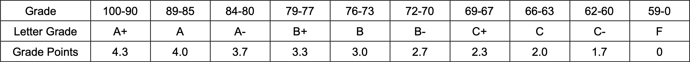

## GPA calculator
<details>
<summary>Details</summary>

Level: Hard  
Tags: If/else, Loop, Basic Types  
Problem ID: [Gi4unmdMp4B1](https://ckj.imslab.org/#/problems/Gi4unmdMp4B1)  
</details>

### Description
According to the [National Cheng Kung University Transcript Guide](https://reg-acad.ncku.edu.tw/var/file/41/1041/img/588/365938743.pdf) NCKU has both a numerical grading system and a letter grading system to mark grades on the transcript. The letter grading system can be presented as A, B, C, and F. Within grade A, grade B, and grade C, each can have an optional “+” or “-”.

Each grade have a corresponding grade point which can be used to calculate GPA, the formula for GPA is `GPA = (credit * grade point) / total credit` The following table is the equivalent values for grade, letter grade and grade points.




Please calculate the GPA using the formula and table above.


### Input
The input will be a sequence of Number, Alphabet and an optional “+” or “-”, the number represents the credit, the alphabet represents the grade letter. The sequence may be repeated multiple times, for example: 3C, 3A2B+1A-, 3F2B-2B-2A, and at the end of the input will be a  "\n" character. You don’t need to worry about invalid input such as 1F-2B, 3B++1A,3G4X.
### Output
The GPA printed to 2 decimal place

### Example 1
#### Input
```
2A+3B+2F1C-3C+1C+2C-

```
#### Output
```
2.34
```

### Example 2
#### Input
```
3C1B2F1F2F1B2C+

```
#### Output
```
1.38
```

### Limits
Your program needs to finish task in 1 seconds.  
Your program can only use memory less than 5000 KB.  
