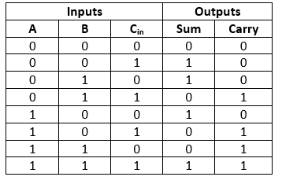

## 5-bits Full Adder
<details>
<summary>Details</summary>

Level: Easy  
Tags: Function, Expression  
Problem ID: [uNbqAoAj4kS8](https://ckj.imslab.org/#/problems/uNbqAoAj4kS8)  
</details>

### Description
**全加器 (Full adder)** 是一個基本的電路，用來將兩個二進制整數相加。


全加器每一次的運算會將兩個二進制整數的相同位數（記為 `A`,`B`）和前一位的進位（記為 `C_in`）相加，然後輸出相加的和 （記為`Sum`）與進位（記為`Carry`）。上述的 `A`, `B`, `C_in`, `Sum`, `Carry` 都是一個位元。全加器的真值表 (truth table) 如下：




舉例來說，假設我們想要相加的兩個二進制整數分別是 `A = 0b11010`, `B = 0b01010`，進行加法時我們會從低位數往高位數加，每一次只相加一個位數，相加時除了將 A 和 B 的當前位數相加之外，也要加上前一位數的進位，才能決定當前位數的和（就跟我們在運算十進制加法一樣），相加的過程如下：


```
       LSB     MSB
   A    0 1 0 1 1
   B    0 1 0 1 0
(Carry)   0 1 0 1 1
---------------
  Sum   0 0 1 0 0 
 Carry  0 1 0 1 1
```
因此，`A + B` 的結果為 `0b00100`，且最後會有進位 `1`。

在本題中，我們要完成一個 5-bits 的全加器。程式將會輸入**兩個 5-bits 的二進制整數**，並輸出**一個 5-bits 的和**與**一個 1-bit 的進位**。助教已經完成部分的程式了，請完成剩下的兩個函式 `full_adder_x` 和 `full_adder_c`，分別負責全加器輸出 `Sum` 和 `Carry` 的功能。這兩個函式的輸入都是三個位元，分別代表全加器的 `A`,`B` , `C_in`。請根據上表的內容，利用輸入的參數回傳正確的輸出。


---

A **full adder** is a basic circuit. It is used to sum up two binary integer.


The input of a full adder are the digits of two binary integers (denoted as `A` and `B`) at the same place, and a carry (denoted as `C_in`) from the previous calculation. The output are the sum of `A`, `B` and `C_in` (denoted as `Sum`), and whether the summation leads to a carry (denoted as `Carry`). All these `A`, `B`, `C_in`, `Sum` and `Carry` are bits. The truth table of a full adder is as below:


For example, consider `A = 0b11010` and `B = 0b01010`. When summing up `A` and `B`, we process from LSB to MSB. In each calculation, we only process 1 digit. Beside the digit of `A` and `B`, we also need to sum the carry from previous calculation (just as the summation of decimal numbers). The summing process is as below:


```
       LSB     MSB
   A    0 1 0 1 1
   B    0 1 0 1 0
(Carry)   0 1 0 1 1
---------------
  Sum   0 0 1 0 0 
 Carry  0 1 0 1 1
```
Thus, the sum of `A + B` is `0b00100`, and the carry is `1`.

In this problem, we need to complete a 5-bits full adder. Input two lines of binary integers `A` and `B`, the program needs to output the `Sum` and the `Carry`. TA has implemented a part of the program. **Please complete the remaining two functions** `full_adder_x` **and** `full_adder_c`**, which are responsible for the functions of full adder to output** `Sum` **and** `Carry` **respectively.** The input of each function are 3 bits, representing `A`, `B` and `C_in` respectively. Please return a proper result of the calculation according to the truth table above.


### Input
兩行 5-bits 二進制整數 A 和 B。
Two lines of 5-bits binary integer A and B.

### Output
6 個 bits。前 5 個 bits 代表相加的和，最後一個 bit 代表進位。
6 bits. First 5 bits representing the Sum, and the last bit is Carry.


### Loader Code
<details>
<summary>Loader Code</summary>

```c
#include<stdio.h>

int full_adder_c(int a, int b ,int c);
int full_adder_x(int a, int b, int c);

# define LEN 5

int main() {
    int a[LEN], b[LEN], ans[LEN], c = 0;
    for(int i = 0 ; i < LEN; ++i) {
        scanf("%d", &a[i]);
    }
    for(int i = 0 ; i < LEN; ++i) {
        scanf("%d", &b[i]);
    }

    for(int i = 0 ; i < LEN ; ++i) {
        ans[i] = full_adder_x(a[i], b[i], c);
        c = full_adder_c(a[i], b[i], c);
    }
    for(int i = 0 ; i < LEN; ++i) {
        printf("%d ", ans[i]);
    }
    printf("%d", c);
}
```
</details>


### Example 1
#### Input
```
0 1 0 1 1
0 1 0 1 0

```
#### Output
```
0 0 1 0 0 1
```

### Example 2
#### Input
```
1 1 0 0 1
1 1 1 1 0

```
#### Output
```
0 1 0 0 0 1
```

### Limits
Your program needs to finish task in 1 seconds.  
Your program can only use memory less than 5000 KB.  
