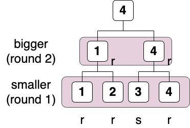

## Rock-Paper-Scissors Tournament
<details>
<summary>Details</summary>

Level: Hard  
Tags: If/else, Array, Function, Recursive  
Problem ID: [q8ynRjPTnUXB](https://ckj.imslab.org/#/problems/q8ynRjPTnUXB)  
</details>

### Description
It is time for the PD1 rock-paper-scissors Tournament!

In this game, each player will be assigned an id **starting from 1**.  
At the begining, players should select one shape from the rock, paper, and scissors, which are used to compete with other players **in the rest of tournament**. Rock wins against scissors; paper wins against rock; and scissors wins against paper.  
The tournament is single-elimination, in which the player who wins the current round goes through next round.  
The players may pick the same shape in a competition, in which case the winner is decided by their id. **In each round**, the tournament host will provide an instruction, one of `b` and `s`, which indicates the player with the **bigger id** or the **smaller id** wins respectively.

Here is the 4-players game example:

**player input**  
`r` : rock  
`p` : paper  
`s` : scissors

**judge input**  
`s` : smaller  
`b` : bigger

player: `r` `r` `s` `r`  
judge: `s` `b`

The player 4 wins the game!  



Please write a program to determine who is the victor.


### Input
The first number N is power of two with range 1 ~ 1024 indicates the number of players.
The second line with N characters indicates the shape picked by the players.
The third line with log2(N) characters indicates the card picked by the host.
### Output
A number indicates the victor’s player id.

### Example 1
#### Input
```
4
rrsr
sb

```
#### Output
```
4

```

### Example 2
#### Input
```
4
psps
ss

```
#### Output
```
2

```

### Example 3
#### Input
```
8
rppssspr
bbs

```
#### Output
```
4

```

### Limits
Your program needs to finish task in 1 seconds.  
Your program can only use memory less than 5000 KB.  
