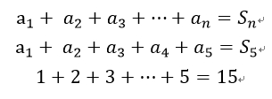
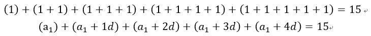

## 等差數列和 Sum of Arithmetic Progression
<details>
<summary>Details</summary>

Level: Easy  
Tags: Recursive  
Problem ID: [Y3I7uDb2RGNz](https://ckj.imslab.org/#/problems/Y3I7uDb2RGNz)  
</details>

### Description
等差數列 (Arithmetic Progression, AP) 中的數，稱為項 (term)。**第一個項，稱為首項，以 a\_1 表示**；**第 n 個項，稱為末項，以 a\_n 表示**；**公差 (common difference)，以 d 表示**。

一個等差數列的首 n 項之和，稱為**等差數列和**（sum of arithmetic progression, sum of arithmetic sequence）或算術級數（arithmetic series），**記作 S\_n**。

舉例如下，有一個 1 為首項、5 為末項、公差為 1 的等差數列，其和為 15。




而計算時可以拆解成以下的想法：




請**使用遞迴的概念來完成剩下的一個函式 sum**。已知**任意輸入的首項、末項、公差，將首項傳入 sum 函式後，計算出其等差數列和**。

**注意：首項 a\_1、末項 a\_n、公差 d，這三個是全域變數 (Global variable)。**全域變數是指直接宣告在（主）函式之外的變數，因此這三個變數可以同時在 main 函式和 sum 函式中使用。

The numbers in the Arithmetic Progression (AP) are called terms. **The first term, called the first term, is denoted by a\_1**; **the nth term, called the last term, is denoted by a\_n**; and **the common difference is denoted by d**.

The sum of the members of a finite arithmetic progression is called an **arithmetic series (sum of arithmetic progression, sum of arithmetic sequence)**, and **is denoted by S\_n**.

For example, there is an equal series with 1 as the first term, 5 as the last term, and a tolerance of 1, and its sum is 15.


And the calculation can be broken down into the following ideas.


**Use the concept of recursion to complete the remaining function sum**, where the **first term, last term, and common difference of any input are known**, and the **first term is passed into the sum function to calculate the sum of arithmetic progression**.

**Note: The first term a1, the last term an, and the common difference d are global variables.** Global variables are those variables declared directly outside the (main) function, so these three variables can be used in both the main function and the sum function.


### Input
三個全域變數，皆為整數。分別為首項 a_1、末項 a_n、公差 d，三個變數間各以一個空白隔開。
首項與尾項的範圍為 -10000~10000，公差的範圍0~10000，所有皆為合法的輸入。

Three global variables, all integers. The first term a_1, the last term a_n, and the tolerance d are separated by a space between each of the three variables.
The range of first and last items is -10000~10000, and the range of common difference is 0~10000, all are legal inputs.
### Output
等差數列和 (sum of arithmetic progression, sum of arithmetic sequence)，又稱算術級數 (arithmetic series)。

Arithmetic series (sum of arithmetic progression, sum of arithmetic sequence).

### Loader Code
<details>
<summary>Loader Code</summary>

```c
#include <stdio.h>

int a_1, a_n, d;

int sum(int a_i);

int main()
{
    scanf("%d %d %d", &a_1, &a_n, &d);
    printf("%d", sum(a_1));
    return 0;
}
```
</details>


### Example 1
#### Input
```
1 5 1
```
#### Output
```
15
```

### Example 2
#### Input
```
1 10 1
```
#### Output
```
55
```

### Example 3
#### Input
```
-100 2000 5
```
#### Output
```
399950
```

### Example 4
#### Input
```
-7569 0 87
```
#### Output
```
-333036
```

### Limits
Your program needs to finish task in 1 seconds.  
Your program can only use memory less than 5000 KB.  
