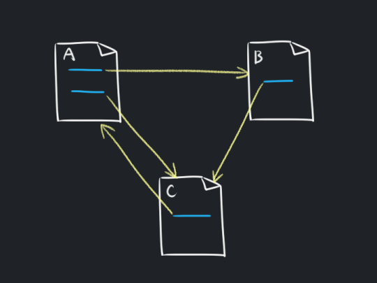
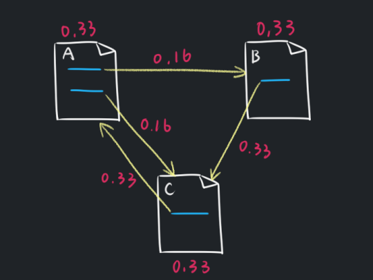
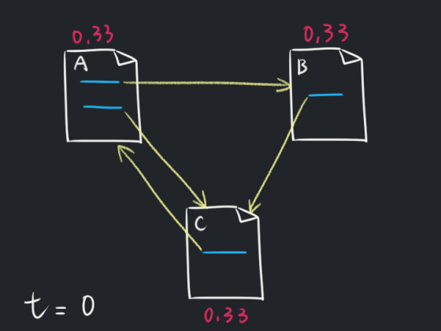

## [15 points] PageRank
<details>
<summary>Details</summary>

Level: Hard  
Tags: If/else, Loop, Array, Basic Types, Format I/O  
Problem ID: [HtBgMZEW8fMd](https://ckj.imslab.org/#/problems/HtBgMZEW8fMd)  
</details>

### Description
**PageRank** is an algorithm that used by Google to sort the searching result. This algorithm calculates the rank of a page via the quality and the number of hyperlinks that point to it. The algorithm supposes that there are many hyperlinks point to a web page if it is important.

A higher PageRank indicates the website is more important. On the other hand, the PageRank of a web page is the probability of a user who visits a hyperlink on a web page randomly and finally reaches the target one. Thus, the PageRank should be an number lies between 0 and 1, and the sum of PageRank of all web pages should be 1.

The following figure is an example: Given three web pages A, B and C. Web page B and C are referenced by A, C is referenced by B and finally A is referenced by C.



Each web page starts with an equal importance which is as known as PR. Since the sum of all PRs should be 1, the PR of each web page is initialized to 1/N, the N indicates the number of web pages, which is 3 in this case, thus the PR of each web page is initially 1/3. 

Next, the PRs are updated by the number of hyperlinks. We may imagine that a web page X references another web page Y as "X votes to Y". If X only has reference to Y, than Y gets 1 point from X; but if both Y and Z are referenced by X, they should share the point voted by X. Thus, each of them gets 1/2 point. Moreover, a vote by an important web page should be concerned more valuable than a vote by a less important web page. To present this thought, the point voted by X should be multiplied by its own PR. As shown in the following figure, A votes to B and C, which makes both B and C gets 1/2 \* 1/3 = 1/6 points.



The points voted to a web page are summed up to be the new PR of the web page. For example, as shown in the above figure, the new PR of web page C is 1/6 + 1/3 = 1/2. After several iterations over the steps mentioned above, the PR of a web page will converge to a fixed value which becomes the PageRank of it. 

As following animation presents: after repeating the process with enough times (20 iterations in this case), the PR of each web page is 0.4, 0.2 and 0.4 respectively. The values will remain unchanged in the further iterations.   



The PR of a web page `u` at the given time `t` can be written in to following equation:

`PR(t, u) = sum( PR(t - 1, v) / L(v) ) for all v link to u`

where `v` indicates a web page that references `u`, and `L(v)` indicates the number of hyperlinks in the web page `v`. 

Now, given a set of web pages and the hyperlinks of each web page in the set, please calculate the PR of each web page.


---

**PageRank**，又稱**網頁排名**，是Google公司所使用的對其搜尋引擎搜尋結果中的網頁進行排名的一種演算法，他本質上是一種以網頁之間的超連結個數和品質作為主要因素粗略地分析網頁的重要性的演算法。其基本假設是：更重要的頁面往往會有更多其他頁面擁有通向該頁面的超連結，因此我們可以透過「一個網頁有多少很重要的網頁通向他」來計算一個網頁的 PageRank。PageRank 愈高，就表示這個網頁愈重要。在實質意義上，PageRank 可以視為：「有一個使用者不斷在進入一個網站後，隨機點擊頁面上的超連結，最後會抵達某網頁的機率值」。因此，所有網頁的 PageRank 都應該介於 0 - 1 之間，並且總和應該要是 1。

我們來看一個簡單的例子：給定一個網頁的集合，該集合內有 A, B, C 三個網頁。其中 A 當中有通向 B 和 C 的超連結，B 當中有通向 C 的超連結，C 當中有通向 A 的超連結。如下圖所示：


一開始所有人的重要程度都是一樣的，我們把重要程度叫作 PR，並且因為總和要是 1，所以大家的 PR 都要被初始化為 1 / N，其中 N 是這個集合的大小。在這個例子當中 N = 3，所以每個人一開始的 PR 都會是 1/3。

接著我們要透過超連結的數量來更新 PR 值。我們把「X 有一個通向 Y 的超連結」想像成是「X 投了票給 Y」，如果 X 只有投給 Y 的話，那麼 X 就是投了 1 票給 Y；但如果 X 同時投給 Y 跟 Z，那麼就視為 X 各投了 0.5 票給 Y 跟 Z。但不同重要性的網頁投的一票應該有不同的價值，如果一個網頁被一個影響力很高的網頁投了一票，他的重要性應該會比只有被一個不重要的網站投了一票還要更高的。我們必須把 X 的重要性考量進得票分數當中，由於 PR 愈高就表示一個網頁愈重要，因此我們可以把 X 投出的票數乘上他的 PR 值，來反應他的重要程度。在這個例子當中，A 一開始的 PR 值是 1/3，他分別給 B 跟 C 各投了一票，所以 B 跟 C 分別得到了 1/6 分，如下圖所示。


所有人的投票都確定之後，我們可以把一個網頁的得分給加總起來，就是該網頁的新的 PR 值。例如上圖中 C 網頁的 PR 值就是 1/6 + 1/3 = 1/2 = 0.5。透過不斷迭代這個計算過程，最後所有網頁的 PR 值會收斂到某一個數字，我們就把最後收斂到的那個數字當作該網頁的 PageRank。如下方動畫所示：  


在重複這個步驟夠多次（以上圖來說是 20 次）之後，這三個網頁的 PR 值分別會是 0.4, 0.2, 0.4，接著就算再重複更多次，三個網頁的 PR 值也會維持在這個數字不動。

我們可以形式化的將上述問題描述成以下格式：在任意時間點 `t` ，一個網頁 `u` 的 PR 值 `PR(t, u)` 為

`PR(t, u) = sum( PR(t - 1, v) / L(v) ) for all v link to u`

其中 `v` 是一個有超連結通向網頁 `u` 的網頁，`L(v)` 是 `v` 網頁中的超連結總數（也就是他總共連出去到幾個網頁）。

現在，給定你一個網頁的集合，以及該集合中的每個網頁通向哪些網頁，請你計算出每一個頁面的 PageRank。


### Input
The first line is an integer N (3 <= N <= 100), indicates the number of web page in the set.
The following N lines contains several integers, which indicate the index of referenced pages. For example: the 1st line contains 1, 2, which means page 0 has hyperlinks that link to page 1 and page 2.
Each line will end with -1 that indicates the termination of that line.
### Output
N percentage numbers rounded to 2 decimal place that indicate PageRank of each web page. For example, if PageRank of a web page is 0.2, you should print "20.00%" for that page.

### Example 1
#### Input
```
3
1 2 -1
2 -1
0 -1
```
#### Output
```
40.00% 20.00% 40.00% 
```

### Example 2
#### Input
```
7
6 -1
0 -1
1 -1
2 -1
3 -1
4 -1
5 -1
```
#### Output
```
14.29% 14.29% 14.29% 14.29% 14.29% 14.29% 14.29% 
```

### Example 3
#### Input
```
10
5 -1
0 9 -1
3 -1
4 -1
4 6 -1
4 8 -1
1 2 7 -1
5 -1
6 -1
2 5 9 -1
```
#### Output
```
3.20% 6.40% 8.00% 8.00% 27.20% 11.20% 19.20% 6.40% 5.60% 4.80% 
```

### Limits
Your program needs to finish task in 1 seconds.  
Your program can only use memory less than 32768 KB.  

### Hint
<details>
<summary>Hint</summary>
You can sum up the difference of every PR between result in time t and time t - 1, and take it as the distance between two results. If the distance is smaller than some tiny number, it means that the result is converged.你可以把前後兩次結果的每一個 PR 值的差加總取平均當作兩次結果的距離，當該距離小於某個很小的數字之後，就代表結果已經收斂了。 
</details>
