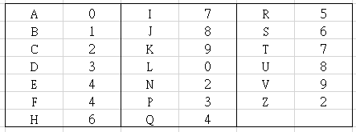

## [20 Points] There is 1 impostor among us
<details>
<summary>Details</summary>

Level: Medium  
Tags: Expression, If/else, Switch, Loop  
Problem ID: [s7nTd_RK2JE3](https://ckj.imslab.org/#/problems/s7nTd_RK2JE3)  
</details>

### Description
助教們發現有一個非成功大學的學生混進了班上，為了要找出他助教們想到一個超棒的方法來找出冒充者是誰。成功大學的學號有9碼，前八碼表示學生的資訊，而第九碼為**校驗碼**。助教們拿到了所有學生的學號並用以下規則來檢查學號是否有效。

* 第一碼為英文字母，請使用下表將英文字母轉換為數字。
* 

從右至左，將第 `k` 個數字乘 `k`。
* 將所有數字乘 `k` 的結果相加，結果必須可**被 10 整除**才為有效學號。

舉例來說，學號為 C34031328 是有效的因為


```
C34031328 = 2x9 + 3x8 + 4x7 + 0x6 + 3x5 + 1x4 + 3x3 + 2x2 + 8x1 = 110
```
請寫一個能驗證學號的程式，並輸出此學生是否為冒充者。

TAs found out that one student, who is not a NCKU student, had sneaked into our class. In order to find out who he/she is, TAs got a genius idea to find out who the impostor is. An NCKU student ID has 9 characters, where the first 8 characters are information about the student, and the 9th character is a **check digit**. TAs get all student IDs in class and use the following rules to check whether the IDs are valid.

* The first character is an English letter, you can follow the table below to convert it to a number.
* 

Counting from right to left, you need to multiply the `k`th number by `k`.
* Sum all the multiplied numbers. For a legal school ID, the sum must be **divisible by ten**.

For example, the ID C34031328 is legal since


```
C34031328 = 2x9 + 3x8 + 4x7 + 0x6 + 3x5 + 1x4 + 3x3 + 2x2 + 8x1 = 110
```
Please write a program that can validate school ID and output whether the student is impostor.


### Input
若干行學生的學號。學號的第一碼一定為一個英文字母（大小寫皆有可能），後面接著 8 個數字。最後一行為一個換行。
Multiple lines of student ID. The ID always starts with an alphabet (could be uppercase or lowercase), and are followed by 8 digits. The last line contains only one newline.
### Output
依據每個學號，如果學生是冒充者輸出 "學號 is the imposter!!!\n" 例如："A12345677 is the imposter!!!\n"
For every student ID output "ID is the imposter!!!\n" if he/she is an imposter. For example: "A12345677 is the imposter!!!\n".

### Example 1
#### Input
```
u35121562
c85945033
K06495498
A13096354


```
#### Output
```
A13096354 is the imposter!!!

```

### Example 2
#### Input
```
e85032016
a49134058
E43811371
k53834114
Q56543254


```
#### Output
```
e85032016 is the imposter!!!

```

### Limits
Your program needs to finish task in 1 seconds.  
Your program can only use memory less than 5000 KB.  
